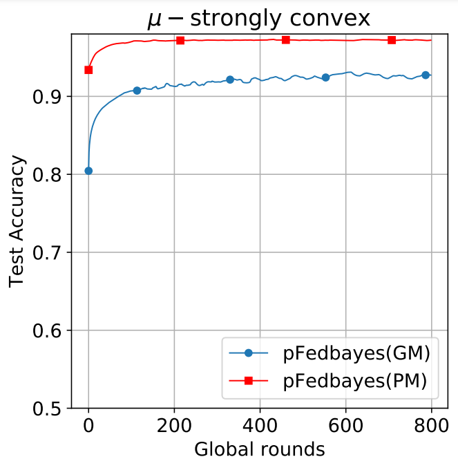

# Personalized Federated Learning via Variational Bayesian Inference [ICML 2022]
This is the **unofficial** implementation of **Personalized Federated Learning via Variational Bayesian Inference**

Paper:https://proceedings.mlr.press/v162/zhang22o/zhang22o.pdf or https://arxiv.org/abs/2206.07977

I spent a lot of time on this. If you find it helpful, please star.

**I do not guarantee that my code will achieve the full performance of the original paper, although my experiments match the accuracy in their paper.**

# Software requirements:
- numpy, scipy, torch, Pillow, matplotlib.

- To download the dependencies: **pip3 install -r requirements.txt**

# Dataset: We use MNIST datasets
- To generate non-idd MNIST Data: 
  - Access data/Mnist and run: "python3 generate_niid_users_mnist.py"
  - We can change the number of user and number of labels for each user using 2 variable NUM_USERS = 10 and NUM_LABELS = 5
- To train model：
  - run："python3 main.py"

# Produce experiments and figures
- There is a main file "main.py" which allows running all experiments.

## Using same parameters
- To produce the experiments for pFedBayes using MNIST dataset, the parameters are set to ρ=-2.5, ζ=10.0, η=0.001, the PM model has an accuracy rate of 97.30%, and the GM reached 93.10% (in their paper, under this setting PM has an accuracy rate of 97.09±0.13%, and the GM reached 92.33±0.76%):

- The parameters are all preset in the main file, or use the following command
    <pre><code>
    python3 main.py --dataset Mnist --model pbnn --batch_size 100 --learning_rate 0.001 --personal_learning_rate 0.001 --beta 10 --lamda 15 --num_global_iters 800 --local_epochs 20 --algorithm pFedBayes --numusers 10 --times 1
    </code></pre>
  
- All the train loss, testing accuracy, and training accuracy will be stored as h5py file in the folder "results". 
We have store the data for persionalized model and global of pFedBayes in 1 files following format: 
Mnist_pFedBayes_x_x_x_xu_xb_x_x_plr_x_lr_x.h5, and another file stores the data results necessary for drawing.

- In order to plot the figure, set parameters in file main_plot.py similar to parameters run from previous experiments. It is noted that each experiment with different parameters will have different results, the configuration in the plot function should be modified for each specific case.
  For example. To plot the comparision in convex case for the above experiments, in the main_plot.py set:
   <pre><code>
    numusers = 10
    num_glob_iters = 800
    dataset = "Mnist"
    local_ep = [20]
    lamda = [15]
    learning_rate = [0.001]
    beta =  [10]
    batch_size = [100]
    K = [5]
    personal_learning_rate = [0.001]
    algorithms = [ "pFedbayes"]
    plot_summary_one_figure_mnist_Compare(num_users=numusers, loc_ep1=local_ep, Numb_Glob_Iters=num_glob_iters,
                                          lamb=lamda, learning_rate=learning_rate, beta=beta,
                                          algorithms_list=algorithms, batch_size=batch_size, dataset=dataset, k=K,
                                          personal_learning_rate=personal_learning_rate)
    </code></pre>

## Effect of hyper-parameters:
For all the figures for effect of hyper-parameters, we use Mnist dataset and fix the learning_rate == 0.001 and personal_learning_rate == 0.001 for all experiments.
Other parameters are changed according to the experiments.

## Reference:
pFedMe: https://github.com/CharlieDinh/pFedMe

=======
# pFedBayes
>>>>>>> 5d6fe7e7ff6779c7421dd6e2654aec1d98436c29
